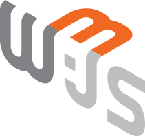

<div align="center">
  <br />
  
  <br />
  <h2>블록체인을 사용한 NFT 스포츠 티켓 예매 및  후원 서비스, S:tickey</h2>
<h3>삼성 청년 소프트웨어 아카데미 특화 프로젝트 최우수상 수상 🏆</h3>
  <a href="https://j10d211.p.ssafy.io/">
   
  </a>
  <a href="https://lumpy-crayon-fd9.notion.site/afc4123e7a6247019f8b598024f5db9f?pvs=4">
   
  </a>
    <a href="https://www.figma.com/file/HYgm9OCn3uL6jRCn1CfsJr/S%3Atickey?type=design&node-id=0%3A1&mode=design&t=sGqjEtyZ7ZcTZlsy-1">
   
  </a>
  <a href="http://i10d208.p.ssafy.io:8081/api/swagger-ui/index.html">
   
  </a>

<b>SSAFY 특화 PJT TEAM 올록블록</b>

<p align='center'>
    <a href="https://hits.seeyoufarm.com"></a>
</p>

<br />

</div>

## 목차

1. [**웹 서비스 소개**](#1)
1. [**기술 스택**](#2)
1. [**주요 기능**](#3)
1. [**프로젝트 구성도**](#4)
1. [**서비스 화면**](#5)
1. [**개발 팀 소개**](#6)
1. [**개발 기간 및 일정**](#7)
1. [**디렉터리 구조**](#8)
1. [**산출물**](#9)

 <!-- 1. [**실행 방법**](#8) -->

<br />

<div id="1"></div>

## ✨ 웹 서비스 소개

**S:tickey**는 프로 스포츠 경기 정보를 제공하여 경기를 티켓팅하고 관리하는 서비스입니다.<br/>
S:tickey를 사용하여 프로 스포츠를 즐기는 국내 관람객들에게 암표 거래가 불가능한 공정한 티켓(NFT) 구매 및 사용 환경을 제공합니다.<br/>
또한 블록체인 네트워크에 결제 내역과 후원 내역을 저장하여 투명하게 관리합니다.<br/>

### [S:tickey 바로 가기](https://j10d211.p.ssafy.io/) (서비스 종료)

<br/>

<div id="2"></div>

## 🛠️ 기술 스택

### Frontend

<table>
  <tr align='center'>
    <td width="80px" height="60px">
      <a href="https://www.tcpschool.com/html/html5_intro_intro" target="_blank"></a>
    </td>
    <td width="80px" height="60px">
      <a href="https://www.w3schools.com/css/" target="_blank"></a>
    </td>
    <td width="80px" height="60px">
      <a href="https://reactjs.org/" target="_blank"></a>  
    </td>
    <td width="80px" height="60px">
      <a href="https://www.typescriptlang.org/" target="_blank"></a>  
    </td>
    <td width="80px" height="60px">
      <a href="https://www.tailwindcss.com/" target="_blank"></a>
    </td>
  </tr>
  <tr align='center'>
    <td>HTML5</td>
    <td>CSS3</td>
    <td>React</td>
    <td>Typescript</td>
    <td>Tailwind<br/> CSS</td>
  </tr>
</table>

<table>
  <tr align='center'>
    <td width="80px" height="60px">
      <a href="https://tanstack.com/query/latest/docs/framework/react/overview" target="_blank"></a>
    </td>
    <td width="80px" height="60px">
      <a href="https://zustand-demo.pmnd.rs/" target="_blank"></a>
    </td>
    <td width="80px" height="60px">
      <a href="https://eslint.org/" target="_blank"></a>
    </td>
    <td width="80px" height="60px">
      <a href="https://stomp-js.github.io/" target="_blank"></a> 
    </td>
    <td width="80px" height="60px">
      <a href="https://axios-http.com/kr/docs/intro" target="_blank"></a>
    </td>
  </tr>
  <tr align='center'>
    <td>React<br/>Query</td>
    <td>Zustand</td>
    <td>Eslint</td>
    <td>Stomp js</td>
    <td>Axios</td>
  </tr>
</table>

<table>
  <tr align='center'>
    <td width="80px" height="60px">
      <a href="https://prettier.io/" target="_blank"></a>
    </td>
    <td width="80px" height="60px">
      <a href="https://vitejs.dev/" target="_blank"></a>
    </td>
    <td width="80px" height="60px">
      <a href="https://docs.web3js.org/guides/getting_started/introduction" target="_blank"></a>
    </td>
  </tr>
  <tr align='center'>
    <td>Prettier</td>
    <td>Vite</td>
    <td>Web3js</td>
  </tr>
</table>

<br/>

### Backend

<table>
  <tr align='center'>
    <td width="80px" height="60px">
      <a href="https://www.java.com/" target="_blank"></a> 
    </td>
    <td width="80px" height="60px">
      <a href="https://docs.spring.io/spring-framework/docs/3.0.x/reference/expressions.html#:~:text=The%20Spring%20Expression%20Language%20(SpEL,and%20basic%20string%20templating%20functionality." target="_blank"></a>   
    </td>
    <td width="80px" height="60px">
      <a href="https://hibernate.org/" target="_blank"></a>  
    </td>    
    <td width="80px" height="60px">
      <a href="https://stomp-js.github.io/" target="_blank"></a>
    </td>  
    <td width="80px" height="60px">
      <a href="https://redis.io/" target="_blank"></a>
    </td>
  </tr>
  <tr align='center'>
    <td>Java</td>
    <td>Spring</td>
    <td>Hibernate</td>
    <td>Stomp js</td>
    <td>Redis</td>
  </tr>
</table>

<table>
  <tr>
    <td width="80px" height="60px">
      <a href="https://swagger.io/" target="_blank"></a>
    </td>
    <td width="80px" height="60px">
      <a href="http://www.jasypt.org/" target="_blank"></a>
    </td>
    <td width="80px" height="60px">
      <a href="https://spring.io/projects/spring-security" target="_blank"></a>
    </td>
    <td width="80px" height="60px">
      <a href="https://www.mysql.com/" target="_blank"></a>
    </td>
  </tr>
  <tr align='center'>
    <td>Swagger</td>
    <td>JWT</td>
    <td>Spring<br/>security</td>
    <td>MySQL</td>
  </tr>
</table>

<br/>

### BlockChain

<table>
  <tr align='center'>
    <td width="80px" height="60px">
      <a href="https://soliditylang.org/" target="_blank"></a>
    </td>
    <td width="80px" height="60px">
      <a href="https://archive.trufflesuite.com/" target="_blank"></a>
    </td>
    <td width="80px" height="60px">
      <a href="https://archive.trufflesuite.com/ganache/" target="_blank"></a>
    </td>
    <td width="80px" height="60px">
      <a href="https://www.openzeppelin.com/" target="_blank"></a>
    </td>
  </tr>
  <tr align='center'>
    <td>Solidity</td>
    <td>Truffle</td>
    <td>Ganache</td>
    <td>Open<br/>zeppelin</td>
  </tr>
</table>

<br/>

### DevOps

<table>
  <tr align='center'>
    <td width="80px" height="60px">
      <a href="https://aws.amazon.com/" target="_blank"></a> 
    </td>
    <td width="80px" height="60px">
      <a href="https://www.docker.com/" target="_blank"></a> 
    </td>
    <td width="80px" height="60px">
      <a href="https://www.nginx.com/" target="_blank"></a>  
    </td>
    <td width="80px" height="60px">
      <a href="https://www.jenkins.io/" target="_blank"></a>  
    </td>
  </tr>
  <tr align='center'>
    <td>AWS</td>
    <td>Docker</td>
    <td>Nginx</td>
    <td>Jenkins</td>
  </tr>
</table>

<br/>

### Tools

<table>
  <tr>
    <td width="80px" height="60px">
      <a href="https://www.notion.so/" target="_blank"></a>
    </td>
    <td width="80px" height="60px">
      <a href="https://about.gitlab.com/" target="_blank"></a>
    </td>
    <td width="80px" height="60px">
      <a href="https://www.atlassian.com/ko/software/jira" target="_blank"></a>  
    </td>
    <td width="80px" height="60px">
      <a href="https://mattermost.com/" target="_blank"></a>
    </td>
  </tr>
  <tr align='center'>
    <td>Notion</td>
    <td>Gitlab</td>
    <td>Jira</td>
    <td>Mattermost</td>
  </tr>
</table>

<br/>

<div id="3"></div>

## 💡 주요 기능

<table style="word-break: keep-all;">
<tr ><th style="text-align:center;">기능</th><th>내용</th></tr>
<tr>
  <td style="text-align:center;">스포츠 경기 조회</td>
  <td>서비스에 등록된 축구, 야구, 농구 경기를 조회하고 해당 경기에 대한 정보를 확인하고 티켓팅할 수 있습니다.</td>
</tr>

<tr>
  <td style="text-align:center;">티켓팅</td>
  <td>좌석 선점, 대기열, 참가열 기능을 구현하여 사용자에게 원할한 티켓팅 환경을 제공합니다.</td>
</tr>

<tr>
  <td style="text-align:center;">알림 서비스</td>
  <td>선호 구단을 등록하고, 해당 구단의 경기 예매가 시작되기 전 알림을 받을 수 있습니다. 단체 회원의 경우 회원가입과 후원 글 승인에 대해서 알림을 받을 수 있습니다.</td>
</tr>

<tr>
  <td style="text-align:center;">블록체인 결제</td>
  <td>이용자가 등록한 메타마스크 지갑과 서비스를 연결하여 티켓을 결제하거나 후원 글에 후원합니다. 구매한 티켓은 NFT로 관리되며 예매에 대한 보상으로 일정량의 Token '꿈' 을 지급합니다.</td>
</tr>

<tr>
  <td style="text-align:center;">후원</td>
  <td>단체 회원이 후원 글을 작성하고 관리자에게 승인 받은 후원 글에 대해 서비스 사용자는 블록체인 결제를 통해 해당 글에 후원을 하고 이력을 남길 수 있습니다.</td>
</tr>

<tr>
  <td style="text-align:center;">티켓 꾸미기</td>
  <td>구매한 티켓에 대하여 사용자는 자신이 가진 Token '꿈'을 지불해 티켓을 꾸밀 수 있습니다.</td>
</tr>

<tr>
  <td style="text-align:center;">블록체인 조회</td>
  <td>블록체인을 통해 이루어진 활동을 기록하여 조회합니다. (결제 내역, 환불 내역, 꿈 내역, 가진 티켓 조회)</td>
</tr>

</table>

<br/>

<div id="4"></div>

## 📂 프로젝트 구상도


<br/>


<br/>

<div id="5"></div>

## 🖥️ 서비스 화면

<table style="border: 2px; text-align:center;">
  <tr style="text-align:center;">
    <td> 회원가입 </td>
    <td> 메인 화면 </td>
  </tr>
  <tr>
   <td>
     
    </td>
    <td>
 
    </td>
  </tr>
</table>

<br/>
<br/>

<table style="border: 2px; text-align:center;">
  <tr style="text-align:center;">
    <td> 경기 목록 </td>
    <td> 예매 대기열 </td>
    <td> 좌석 선택 </td>
  </tr>
  <tr>
   <td>
 
    </td>
    <td>
 
    </td>
    <td> 
 
    </td>
  </tr>
</table>

<table style="border: 2px; text-align:center;">
  <tr style="text-align:center;">
    <td> 결제 완료 </td>
    <td> 티켓 목록 </td>
    <td> 티켓 환불 </td>
  </tr>
  <tr>
   <td>
 
    </td>
    <td>
 
    </td>
    <td> 
 
    </td>
  </tr>
</table>

<table style="border: 2px; text-align:center;">
  <tr style="text-align:center;">
    <td> 티켓 꾸미기 </td>
    <td> 티켓 조회 </td>
  </tr>
  <tr>
   <td>
 
    </td>
    <td>
 
    </td>
  </tr>
</table>

<br/>
<br/>

<table style="border: 2px; text-align:center;">
  <tr style="text-align:center;">
    <td> 후원 </td>
    <td> 결제 내역 </td>
    <td> 꿈 내역 </td>
  </tr>
  <tr>
   <td>
 
    </td>
    <td>
 
    </td>
    <td> 
 
    </td>
  </tr>
</table>

<br/>

<div id="6"></div>

## 👨🏻‍💻 개발 팀 소개

<table>
<tr>
<td align="center">FE</td>
<td align="center">FE</td>
<td align="center">FE / Blockchain</td>
<td align="center">BE</td>
<td align="center">BE</td>
<td align="center">BE / INFRA</td>
</tr>
  <tr>
    <td align="center" width="120px">
      <a href="https://github.com/minnnnnk0" target="_blank">
        
      </a>
    </td>
    <td align="center" width="120px">
      <a href="https://github.com/kangjungsuu" target="_blank">
        
      </a>
    </td>
    <td align="center" width="120px">
      <a href="https://github.com/chanyeok1225" target="_blank">
        
      </a>
    </td>
    <td align="center" width="120px">
      <a href="https://github.com/HeewonYoun" target="_blank">
        
      </a>
    </td>
    <td align="center" width="120px">
      <a href="https://github.com/mecuryD" target="_blank">
        
      </a>
    </td>
    <td align="center" width="120px">
      <a href="https://github.com/Ryujy" target="_blank">
        
      </a>
    </td>
    
  </tr>
  <tr>
    <td align="center">
      <a href="https://github.com/minnnnnk0" target="_blank">
        최민경
      </a>
    </td>
     <td align="center">
      <a href="https://github.com/kangjungsuu" target="_blank">
       강정수
      </a>
    </td> 
     <td align="center">
      <a href="https://github.com/chanyeok1225" target="_blank">
       전찬혁
      </a>
       <td align="center">
      <a href="https://github.com/HeewonYoun" target="_blank">
        윤희원
      </a>
    </td>
     <td align="center">
      <a href="https://github.com/mecuryD" target="_blank">
       최부광
      </a>
    </td> 
     <td align="center">
      <a href="https://github.com/Ryujy" target="_blank">
       류지윤
      </a>
  </tr>
</table>

<br />

<div id="7"></div>

## 🗓️ 개발 기간 및 일정

24.02.19. ~ 24.04.04

<br />

<div id="8"></div>

## 📂 디렉터리 구조

### Front-end

```
STICKEY-FRONTEND
📂 src
├─apis
├─assets
│  └─image
│      ├─Carousel
│      ├─Category
│      ├─Ground
│      └─NavigationBar
├─components
│  ├─@common
│  ├─Admin
│  ├─Alarm
│  ├─Book
│  ├─ChangePW
│  ├─FindPW
│  ├─Home
│  ├─Login
│  ├─MyTicket
│  ├─Profile
│  │  ├─Group
│  │  └─User
│  │      ├─Dream
│  │      └─Payment
│  ├─Signup
│  ├─Soccer
│  └─Sponsor
├─hooks
│  ├─Admin
│  ├─Book
│  ├─ChangePW
│  ├─Email
│  ├─FindPW
│  ├─Home
│  ├─Individual
│  ├─Logout
│  ├─Organization
│  ├─Profile
│  └─Sponsor
├─pages
│  ├─Admin
│  ├─Alarm
│  ├─Book
│  │  ├─BookConfirm
│  │  └─BookDetail
│  ├─Home
│  │  ├─BaseBall
│  │  ├─BasketBall
│  │  └─Soccer
│  ├─Login
│  ├─MyTicket
│  │  └─TicketEdit
│  ├─Profile
│  │  ├─Group
│  │  └─User
│  ├─SignUp
│  ├─Splash
│  └─Sponsor
│      ├─SponsorCreatePage
│      └─SponsorDetailPage
├─service
│  ├─Admin
│  ├─Book
│  ├─ChangePW
│  ├─Email
│  ├─FindPW
│  ├─Home
│  ├─IndividualUser
│  ├─Login
│  ├─Logout
│  ├─OrganizationUser
│  ├─Profile
│  ├─Sponsor
│  └─web3
├─stores
└─types
    └─model
```

### Back-end

```
STICKEY-MAIN
📂 main
├─java
│  └─com
│      └─olbl
│          └─stickeymain
│              ├─domain
│              │  ├─admin
│              │  │  ├─controller
│              │  │  ├─dto
│              │  │  ├─entity
│              │  │  ├─repository
│              │  │  └─service
│              │  ├─game
│              │  │  ├─controller
│              │  │  ├─dto
│              │  │  ├─entity
│              │  │  ├─repository
│              │  │  ├─scheduler
│              │  │  └─service
│              │  ├─notify
│              │  │  ├─controller
│              │  │  ├─dto
│              │  │  ├─entity
│              │  │  ├─repository
│              │  │  └─service
│              │  ├─support
│              │  │  ├─controller
│              │  │  ├─dto
│              │  │  ├─entity
│              │  │  ├─repository
│              │  │  └─service
│              │  └─user
│              │      ├─controller
│              │      ├─dto
│              │      ├─entity
│              │      ├─organization
│              │      │  ├─controller
│              │      │  ├─dto
│              │      │  ├─entity
│              │      │  ├─repository
│              │      │  └─service
│              │      ├─repository
│              │      └─service
│              └─global
│                  ├─auth
│                  ├─config
│                  ├─jwt
│                  ├─result
│                  │  └─error
│                  │      └─exception
│                  └─util
└─resources
    ├─static
    └─templates
```

```
STICKEY-WAITING
📂 main
├─java
│  └─com
│      └─olbl
│          └─stickeywaiting
│              ├─config
│              ├─controller
│              ├─dto
│              ├─service
│              └─util
└─resources
    ├─static
    └─templates
```

<br />

<div id="9"></div>

## 📃 산출물

### [1. 기능 명세서](https://lumpy-crayon-fd9.notion.site/71bb6252aea5402d9be7b39d4e4193b4?pvs=4)

### [2. 화면 설계서](https://www.figma.com/file/HYgm9OCn3uL6jRCn1CfsJr/S%3Atickey?type=design&node-id=0%3A1&mode=design&t=sGqjEtyZ7ZcTZlsy-1)

### [3. API 명세서](https://lumpy-crayon-fd9.notion.site/API-3a7a8fd82a19435e90f03ff6bd766167?pvs=4)

### [4. ERD](https://lumpy-crayon-fd9.notion.site/ERD-42bfedc311554109bf63fd5c12a5566e?pvs=4)
